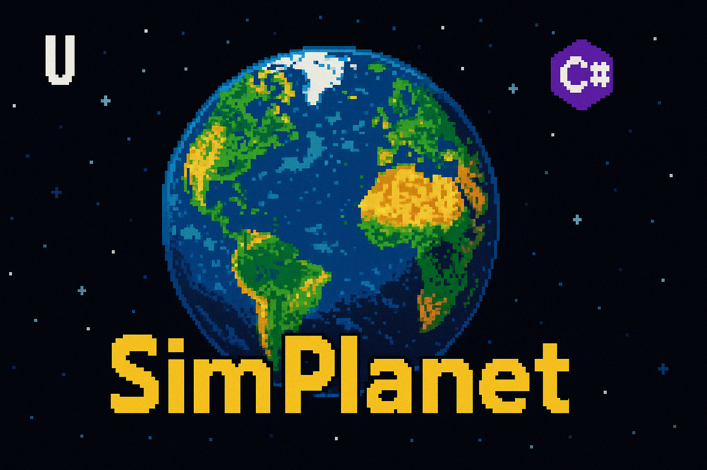

# SimPlanet - Planetary Evolution Simulator - With AI
<div align="center">
  


[](https://dotnet.microsoft.com/)
[](#installation)
[](#license)

</div>

----

 **[READ THE COMPLETE PLAYER GUIDE](PLAYER_GUIDE.md)** - Comprehensive tutorial covering all systems, features, and strategies!

A SimEarth-like planetary simulation game built with C# and MonoGame, featuring:
- Procedural planet generation with Perlin noise and **real-time preview**
- **Full geological simulation** (plate tectonics, volcanoes, erosion, sedimentation)
- **Hydrology system** (rivers, water flow, ocean currents)
- **Weather systems** (storms, seasons, air pressure, wind patterns)
- **Ice cycles** (glaciers, polar ice caps, ice-albedo feedback)
- **Magnetosphere simulation** (cosmic ray protection, auroras, radiation)
- **Surface albedo effects** (realistic solar reflection by terrain type)
- **Civilization development** (technology advancement, territorial expansion, environmental impact)
- **Forest fires** (natural ignition, smoke, rain extinguishing, firefighters)
- **Disease & pandemic system** (6 pathogen types, realistic spread, civilization responses, cure research)
- **Manual terraforming tool** (plant forests, create oceans, seed civilizations)
- **Auto-stabilization system** (maintains habitable conditions automatically)
- **Civilization-aware auto-stabilizer** that keeps settlements safe from drastic flooding/cooling adjustments
- **World-dependent survival modeling** that keeps the auto-balancer and life support checks tied to each planet's actual climate instead of fixed Earth numbers
- **Adaptive life comfort windows** that expand or contract with each world's observed temperature and rainfall swings so forests, fauna, and civilizations stay viable when climates settle down
- **Planet presets** (Earth, Mars, Water World, Desert World)
- **Interactive 3D planet minimap** with manual rotation and tilt controls (just like SimEarth!)
- **Interactive Toolbar** with clickable buttons for all keybindings - small squared buttons with custom icons and tooltips
- **Splash Screen** with beautiful loading animation before game starts
- **Save/load game system** with quick save/load (F5/F9)
- **Main menu** with new game, load game, and pause functionality
- **Spectral band energy view** for inspecting the planet's net radiation budget
- Climate simulation (temperature, rainfall, humidity)
- Atmospheric simulation (oxygen, CO2, greenhouse effects)
- Life evolution from bacteria to civilization with full environmental reactivity
- 14+ visualization modes with geological overlays
- Real-time planetary evolution and geological events
- **100% cross-platform** (Mac M1/Intel, Linux, Windows)

## Features

### Divine Powers & Government Systems

**Play as a God** - Directly interfere with civilizations using divine powers (Press I):

**Government Types:**
- **Tribal**: Simple leadership, low stability
- **Monarchy**: Hereditary rule, single dynasty
- **Dynasty**: Extended royal families with succession
- **Theocracy**: Religious leadership, high legitimacy
- **Republic**: Elected leaders, moderate stability
- **Democracy**: Advanced elected government, high stability
- **Oligarchy**: Rule by elite class
- **Dictatorship**: Single authoritarian ruler
- **Federation**: Advanced unified government

**Diplomatic Relations:**
- **Treaties**: Trade Pacts, Defense Pacts, Military Alliances, Non-Aggression Pacts
- **Royal Marriages**: Political marriages between rulers create lasting alliances
- **Opinion System**: -100 to +100 relationship scores between civilizations
- **Trust Levels**: Breaking treaties destroys trust and damages relations
- **Diplomatic Status**: War, Hostile, Neutral, Friendly, Allied

**Divine Powers (God Mode - Press I):**
- **Change Government**: Overthrow existing government and install new system
- **Send Spies**: Launch espionage missions against civilizations
  - Steal Technology: Gain advanced tech from rivals
  - Sabotage: Destroy resources and infrastructure
  - Assassinate Ruler: Kill leaders and destabilize governments
  - Incite Revolution: Reduce stability and trigger unrest
  - Steal Resources: Transfer wealth between civilizations
- **Force Betrayal**: Make civilizations break treaties and declare war
- **Bless Civilization**: Divine favor (population +20%, resources +50%, stability boost)
- **Curse Civilization**: Divine wrath (population -30%, resources -50%, stability collapse)
- **Advance Civilization**: Boost single civilization (tech +10, population +10%, resources +30%, stability +20%)
- **Force Alliance**: Make civilizations ally regardless of relations
- **Force War**: Trigger wars between civilizations

**Succession & Dynasties:**
- **Hereditary Succession**: Monarchies pass throne to children
- **Dynasty Tracking**: Royal families with generated names (House of Dragon, Dynasty of Phoenix, etc.)
- **Succession Crises**: Dynasties can fall when no heirs exist
- **Ruler Traits**: Wisdom, Charisma, Ambition, Brutality, Piety affect government performance
- **Elected Leaders**: Democracies and Republics elect new rulers when old ones die

### Core Mechanics (SimEarth-like)
- **Terrain Generation**:
  - Procedural height maps with configurable land/water ratios
  - Real-time preview of planet configuration
  - Planet presets: Earth (29% land), Mars (dry, high mountains), Water World (90% ocean), Desert (85% land)
  - Adjustable parameters: size, persistence, lacunarity, mountain level, water level
- **Geological Systems**:
  - 8 tectonic plates with continental drift
  - Plate boundaries (convergent, divergent, transform)
  - Mountain building and subduction zones
  - **Realistic volcano distribution** (rare but impactful)
  - **Volcano lifecycle** with dormant cones fading and new vents forming over time
  - **Volcanic island formation** - underwater volcanoes build into islands
  - Volcanic hotspots and eruption mechanics (effusive, explosive, phreatomagmatic)
  - **Island arc systems** along oceanic-oceanic convergence zones
  - Earthquakes from tectonic stress
  - Erosion (rainfall, temperature, glacial)
  - Sediment transport and deposition
- **Hydrology System**:
  - River formation from mountains to oceans
  - Water flow and valley carving
  - River freezing during ice ages (freeze when >50% covered by ice)
  - Dynamic river reformation when ice retreats
  - **Advanced Ocean Circulation**:
    - Wind-driven surface currents with Coriolis effect (gyres, trade winds, westerlies)
    - **Thermohaline circulation** (density-driven deep ocean currents)
    - Ocean salinity dynamics (evaporation, precipitation, river input, ice formation)
    - Water density calculations based on temperature and salinity (UNESCO equation of state)
    - Deep water formation at polar regions (downwelling)
    - Equatorial upwelling of nutrient-rich deep water
    - Western boundary current intensification (Gulf Stream-like)
    - Global ocean "conveyor belt" circulation
  - Soil moisture dynamics
- **Climate System**:
  - Temperature gradients based on latitude, elevation, and solar energy
  - Rainfall patterns with realistic atmospheric circulation (Hadley, Ferrel, Polar cells)
  - **Subtropical desert belts** form at 25-30° latitude (Sahara-like)
  - Humidity simulation with diffusion
  - **Geographic variation** prevents artificial horizontal banding
  - Surface albedo effects (ice reflects 85%, ocean absorbs 94%)
- **Ice Cycles & Sea Level**:
  - Polar ice caps formation and expansion with **smooth gradients**
  - Mountain glaciers and snow lines
  - **Realistic ice-albedo feedback** (prevents runaway glaciation)
  - Glacier advance/retreat with elevation changes
  - Sea ice formation on frozen oceans
  - **No horizontal ice stripes** - geographic variation creates natural patterns
  - Prevents snowball Earth and runaway ice ages
  - **Ice sheet water level mechanics**:
    - Ice sheets forming on land remove water from oceans → sea level drops
    - Ice sheets melting return water to oceans → sea level rises
    - Realistic glacial-interglacial sea level changes (up to 120m equivalent)
    - Continents flood during warm periods, ocean floors exposed during ice ages
- **Magnetosphere & Radiation**:
  - Planetary magnetic field simulation (Earth-like dynamo)
  - Cosmic ray deflection (70% protection at equator)
  - Solar wind shielding
  - Polar auroras during high solar activity
  - Radiation levels vary by latitude, altitude, and atmosphere
  - Magnetic field reversals
  - Life damage from high radiation
- **Atmosphere**:
  - **Multi-gas atmospheric simulation**:
    - Oxygen (O2) cycle with photosynthesis and respiration
    - Carbon dioxide (CO2) cycle with biological and volcanic sources
    - **Methane (CH4)** - wetlands, decomposition, agriculture, volcanic emissions (28x CO2 potency)
    - **Nitrous oxide (N2O)** - soil microbes, fertilizers, ocean production (265x CO2 potency)
    - Water vapor feedback (temperature-dependent humidity effects)
  - **Multi-layer atmospheric structure**:
    - 4 distinct atmospheric layers (surface, lower troposphere, upper troposphere, stratosphere)
    - Realistic tropospheric lapse rate (-6.5 K/km)
    - Stratospheric temperature inversion from ozone heating
    - Latitude-dependent ozone column (250-400 Dobson Units)
    - Clausius-Clapeyron water vapor distribution
  - **Spectral band radiative transfer**:
    - Two-stream approximation for upward and downward radiation fluxes
    - **Shortwave (solar) radiation**: 0.2-4 μm
      - Ozone UV absorption in stratosphere
      - Rayleigh scattering (blue sky)
      - Cloud reflection and absorption
      - Water vapor near-IR absorption
      - Surface albedo reflection
    - **Longwave (terrestrial IR) radiation**: 4-100 μm
      - Stefan-Boltzmann surface emission
      - Layer-by-layer atmospheric absorption
      - Wavelength-dependent gas absorption:
        - CO2: 15 μm band (logarithmic forcing)
        - H2O: 6.3 μm band + rotation bands (square-root dependence)
        - CH4: 7.6 μm band (square-root saturation)
        - N2O: 7.8 μm band (overlaps with CO2)
      - Cloud thermal emission (near-blackbody)
      - Atmospheric window (8-12 μm) for direct escape
      - Back-radiation from atmosphere to surface
      - Outgoing longwave radiation at top of atmosphere
  - **Net radiation budget**:
    - Surface energy balance from shortwave and longwave fluxes
    - Realistic climate sensitivity based on IPCC AR6 radiative forcing
  - Photosynthesis and respiration
  - Volcanic emissions
  - Atmospheric gas mixing and wind-driven transport
- **Weather Systems**:
  - Dynamic meteorology with seasons (4 seasons per year, hemisphere-aware)
  - Wind patterns (trade winds, westerlies, polar easterlies)
  - Air pressure systems affected by temperature and elevation
  - **Realistic Tropical Cyclones**:
    - Form from cloud-wind interaction over warm oceans (>26°C)
    - Progress from Tropical Depression → Tropical Storm → Hurricane (Categories 1-5)
    - Follow curved trajectories from Coriolis force (right in NH, left in SH)
    - Intensify over warm water, weaken over land or cool water
    - Cyclonic wind patterns with spiral rotation and eye walls
    - Track central pressure, max wind speed, and storm category
    - Storm surge damage on coastlines
    - **Real-time visualization** with animated vortices on both 3D minimap and 2D weather maps
    - **Climate impact**: Sea surface cooling, ocean current disruption, upwelling effects
  - **Animated Weather Visualization**:
    - Semi-transparent cloud layer drifting with wind on 3D minimap
    - Cyclone vortices with spiral arms and eye visualization
    - Synchronized weather display between 3D globe and 2D thematic maps
    - Storm intensity color-coding (blue→yellow→orange→red)
  - Thunderstorms, blizzards, and tornadoes
  - Seasonal temperature variations based on latitude
- **Forest Fire System**:
  - Natural fire ignition from lightning and extreme heat (>35°C)
  - Fire spreads based on biomass density, dryness, and temperature
  - Rain extinguishes fires (heavy rain faster than light rain)
  - Smoke generation increases cloud cover and CO2
  - Industrial+ civilizations deploy firefighters
  - Fire recovery tracking
  - Entire forests can burn if not stopped
- **Disease & Pandemic System**:
  - 6 pathogen types: Bacteria, Virus, Fungus, Parasite, Prion, Bioweapon
  - Realistic disease spread between civilizations
  - Transmission methods: Air, Water, Blood, Livestock, Insects, Rodents, Birds
  - Evolution system: upgrade transmission, symptoms, resistances, and abilities
  - Civilization responses: border closures, airport/port shutdowns, quarantines
  - Cure research based on tech level (faster for Scientific/Spacefaring civs)
  - Population tracking: infected, dead, healthy
  - Drug resistance and genetic reshuffling mechanics
  - Transportation systems affect spread (air travel, ships, railroads)
- **Civilization Development**:
  - Technology progression: Tribal → Agricultural → Industrial → Scientific → Spacefaring
  - **Intelligent city placement** based on resources, defense, and commerce
  - **Road networks** connecting cities and resource sites (dirt paths → roads → highways)
  - **Civilization-induced earthquakes** from oil extraction, fracking, and geothermal energy
  - Population growth and strategic territorial expansion
  - Environmental impact (pollution, deforestation, CO2 emissions)
  - Advanced civilizations can terraform and restore ecosystems
  - Inter-civilization interactions (war, cooperation, technology sharing)
  - Railroad networks connect cities (unlocks at Industrial age)
  - Cities with names, populations, trade systems, and strategic location data
  - Commerce and trade income between cities
  - **Government Systems**: 9 government types (Tribal, Monarchy, Dynasty, Theocracy, Republic, Democracy, Oligarchy, Dictatorship, Federation)
  - **Hereditary Succession**: Monarchies and dynasties pass power to heirs, dynasties can fall and be replaced
  - **Royal Dynasties**: Randomly generated dynasty names and family trees with succession tracking
  - **Diplomatic Relations**: Civilizations form treaties, alliances, trade pacts, and non-aggression pacts
  - **Royal Marriages**: Political marriages between civilizations create lasting alliances
  - **Espionage**: Spy missions to steal technology, sabotage resources, assassinate rulers, or incite revolutions
  - **Government Stability**: Rulers have traits (Wisdom, Charisma, Ambition, Brutality, Piety) affecting stability
  - **Divine Powers (God Mode)**: Player can interfere with civilizations - change governments, send spies, force wars/alliances, bless/curse civs
  - **Disaster Response**: Civilizations respond to cyclones, volcanoes, earthquakes with casualties and political instability
- **Life Evolution**:
  - Bacteria → Algae → Plants → Simple Animals → Complex Animals → Intelligence → Civilization
  - Life spreads and adapts based on environmental conditions
  - **Full reactivity to planetary events**:
    - Volcanic eruptions cause mass extinctions in affected areas
    - Earthquakes damage life based on magnitude
    - Storms (hurricanes, tornadoes, blizzards) affect biomass
    - Climate stress drives evolution and adaptation
    - Sedimentation and environmental changes impact survival
  - Biomass dynamics and ecosystem interactions
- **Manual Terraforming Tool** (Press T):
  - Plant forests, grasslands, deserts, tundra
  - Create oceans and raise mountains
  - **Create fault lines** (5 types: Strike-Slip, Normal, Reverse, Thrust, Oblique)
  - Seed new civilizations
  - Adjustable brush size (1-15 radius)
  - Respects terrain constraints for realistic results
  - Scroll wheel adjusts brush size
- **Resource Placement Tool** (Press M):
  - Place 10 resource types: Iron, Copper, Coal, Gold, Silver, Oil, Gas, Uranium, Platinum, Diamond
  - Adjustable deposit amounts (5-100 units)
  - Scroll wheel adjusts amount, R key cycles resource type
  - Resources auto-discovered and ready for civilization extraction
- **Auto-Stabilization System** (Press Y):
  - **ENABLED BY DEFAULT** to prevent runaway climate disasters and life extinction
  - Automatically maintains Earth-like habitable conditions
  - Monitors and adjusts: temperature (target 15°C), oxygen (21%), CO2 (0.04%)
  - Prevents snowball Earth and runaway greenhouse effects
  - Restores magnetic field to protect from radiation
  - Balances land/ocean ratio (target 29%/71%)
  - **ACTIVELY PROTECTS LIFE** - NEW!:
    - Boosts struggling life populations (biomass <20%) in good conditions
    - Moderates extreme temperatures where life exists
    - Ensures minimum oxygen levels for aerobic life
    - Reduces toxic CO2 levels where life is present
    - EMERGENCY MODE: Major biomass boost when life drops below 500 cells
  - Shows real-time status: adjustments made, last action
  - Perfect for hands-off planetary management while nurturing life evolution
  - Press Y to toggle on/off during gameplay
- **Planetary Controls UI** (Press X) - SimEarth-style Parameter Control:
  - **Complete Manual Control** - Adjust every planetary parameter in real-time
  - **15 Control Sliders**:
    - **Climate**: Solar Energy (0.5x-1.5x), Global Temperature Offset (-20°C to +20°C)
    - **Atmosphere**: Rainfall Multiplier (0.1x-3.0x), Wind Speed (0.1x-3.0x), Oxygen (0-50%), CO2 (0-10%), Atmospheric Pressure (500-1500 mb)
    - **Geology**: Tectonic Activity (0.1x-3.0x), Volcanic Activity (0.1x-3.0x), Erosion Rate (0.1x-3.0x)
    - **Surface**: Ice Coverage (0-100%), Ocean Level (-1.0 to +1.0), Albedo/Reflectivity (0.1-0.9)
    - **Magnetosphere**: Magnetic Field Strength (0.0-2.0), Core Temperature (1000-8000K)
  - **AI Stabilizer Controls**:
    - **Restore Planet** - AI automatically adjusts all parameters to habitable Earth-like conditions
    - **Destabilize Planet** - Disable AI and allow natural chaos (ice ages, runaway greenhouse, etc.)
    - **Toggle Auto-Stabilization** - Enable/disable automatic planet balancing
  - **Manual Terraforming Brush** - Paint tiles directly on the map:
    - 8 Tile Types: Forest, Grassland, Desert, Tundra, Ocean, Mountain, Fault Lines, Civilization
    - Adjustable brush size (1-15 cell radius)
    - Scroll wheel to adjust brush size
    - Respects terrain constraints for realistic results
  - **Real-Time Updates** - All changes apply immediately to the simulation
  - **Professional UI** - Organized sliders with clear labels and value indicators
  - Perfect for experimenting with planetary conditions and terraforming
- **Save/Load System**:
  - Quick save with F5, quick load with F9
  - Full menu system with save slots and timestamps
  - Serializes entire game state (terrain, life, civilizations, weather, geology)
- **Time Control**: Adjustable simulation speed (0.25x to 32x)
- **Fast Forward**: Skip 10,000 years in a single click with a progress bar.
- **3D Minimap**: Interactive rotating sphere with accurate spherical projection, realistic ice caps, and manual rotation/tilt controls (SimEarth-style!)

### Visualization Modes
**Standard Views (1-0 keys):**
1. **Terrain**: See the planet surface (oceans, land, forests, deserts, mountains) with day/night cycle and city lights
2. **Temperature**: Heat map showing temperature distribution
3. **Rainfall**: Precipitation patterns across the planet
4. **Life**: Visualization of life forms and biomass
5. **Oxygen**: Atmospheric oxygen levels
6. **CO2**: Carbon dioxide concentration
7. **Elevation**: Height map view
8. **Geological**: Rock types (volcanic, sedimentary, crystalline), erosion, sedimentation
9. **Tectonic Plates**: See all 8 plates with boundaries highlighted
10. **Volcanoes**: Volcanic activity and lava flows

**Meteorology Views (F1-F4 keys):**
11. **Clouds (F1)**: Cloud cover visualization with storm clouds
12. **Wind (F2)**: Wind speed and direction patterns (calm to extreme)
13. **Pressure (F3)**: Air pressure systems (low pressure = blue, high pressure = red)
14. **Storms (F4)**: Active storms with precipitation and wind intensity

**Advanced Views (F10-F12, J keys):**
15. **Biomes (F10)**: Detailed biome classification (15 types: ocean, desert, forest, tundra, etc.)
16. **Albedo (F11)**: Surface reflectivity showing ice-albedo feedback (dark absorbs heat, bright reflects)
17. **Radiation (F12)**: Cosmic ray and solar radiation levels (green=safe, red/purple=deadly)
18. **Resources (J)**: Natural resource deposits (coal, iron, oil, uranium, rare minerals)

**Geological Hazard Views (E, Q, U keys):**
19. **Earthquakes (E)**: Seismic activity with epicenters (red/orange), wave propagation, and stress buildup (blue/purple)
20. **Faults (Q)**: Fault lines color-coded by type - Strike-Slip (yellow), Normal (blue), Reverse (red), Thrust (dark red), Oblique (purple)
21. **Tsunamis (U)**: Ocean wave propagation with wave height (cyan to white gradient) and coastal flooding (brown)

### Geological Overlays (Toggle On/Off)
- **Volcanoes**: Red triangles showing active volcanoes
- **Rivers**: Blue lines showing river networks
- **Plate Boundaries**: Highlighted convergent, divergent, and transform zones
- **3D Minimap**: Rotating globe in bottom-left corner

## Performance Optimizations

SimPlanet uses **true multithreading** for maximum performance and responsiveness:

### Multithreaded Architecture
- **Dedicated Simulation Thread**: All simulation logic runs on a separate background thread
- **World Generation Thread**: Planet creation happens on background thread with progress bar
- **UI Thread Independence**: Main thread handles ONLY input and rendering - always responsive
- **Thread-Safe Synchronization**: Lock-based data access prevents race conditions
- **Clean Separation**: Simulation never blocks UI, UI never blocks simulation
- **Parallel Simulation**: Independent simulators run in parallel, and loops within simulators are parallelized for maximum performance.

### Additional Optimizations
- **Cached Statistics**: UI data cached at 100ms intervals (prevents scanning 20,000 cells every frame)
- **Throttled Terrain Preview**: Map generator preview updates at 150ms intervals (prevents lag during slider adjustments)
- **Background World Generation**: Planet generation with real-time progress bar on separate thread
- **Optimized Rendering**: Texture updates only when data changes (dirty flag system)
- **Split-Screen Layout**: Info panel (400px) on left, resizable map on right - no more overlap!

**Result**:
- UI renders at smooth 60 FPS regardless of simulation complexity
- Window remains responsive even during heavy computation
- Close button (X) always works - no more frozen windows
- Perfect separation between simulation and UI threads

## Requirements

- .NET 8.0 SDK or later
- Works on Linux, macOS, and Windows
- OpenGL-compatible graphics
- Window is resizable! Default: 1600×900 (previously 1280×720)

## Building and Running

### On Linux/macOS:

```bash
# Install .NET 8 if not already installed
# For Ubuntu/Debian:
wget https://dot.net/v1/dotnet-install.sh
chmod +x dotnet-install.sh
./dotnet-install.sh --channel 8.0

# Build and run
cd SimPlanet
dotnet restore
dotnet build
dotnet run
```

### On Windows:

```powershell
# Install .NET 8 from https://dotnet.microsoft.com/download/dotnet/8.0

# Build and run
cd SimPlanet
dotnet restore
dotnet build
dotnet run
```

## Controls

### Interactive Toolbar
The game features a comprehensive toolbar at the top of the screen with clickable buttons for all major functions:
- **View Mode Buttons** (1-0, F1-F4, F10-F12, E, Q, U, J, O, A) - Quick access to all 22 visualization modes
- **Game Control Buttons** - Pause/Resume, Speed Up/Down, Quick Save/Load, Regenerate Planet
- **UI Toggle Buttons** - Help, Map Options, Minimap, Day/Night, Overlays (Volcanoes, Rivers, Plates)
- **Feature Buttons** - Seed Life, Civilization Control, Divine Powers, Disasters, Diseases, Plant Tool, Stabilizer
- **Custom Icons** - Each button has a unique runtime-generated icon representing its function
- **Tooltips** - Hover over any button to see what it does and its keybinding
- All existing keyboard shortcuts still work alongside the toolbar buttons!

### Keyboard Shortcuts

| Key | Action |
|-----|--------|
| **SPACE** | Pause/Resume simulation |
| **1-0** | Change view modes |
| **1** | Terrain view |
| **2** | Temperature view |
| **3** | Rainfall view |
| **4** | Life view |
| **5** | Oxygen view |
| **6** | CO2 view |
| **7** | Elevation view |
| **8** | Geological view (rock types, erosion) |
| **9** | Tectonic Plates view |
| **0** | Volcanoes view |
| **F1** | Clouds view (meteorology) |
| **F2** | Wind view (meteorology) |
| **F3** | Air Pressure view (meteorology) |
| **F4** | Storms view (meteorology) |
| **F10** | Biomes view (advanced) |
| **A** | Albedo/Surface reflectivity view (advanced) |
| **F12** | Radiation levels view (advanced) |
| **J** | Resources view (advanced) |
| **O** | Infrastructure view (civilization infrastructure) |
| **E** | Earthquakes view (geological hazards) |
| **Q** | Faults view (geological hazards) |
| **U** | Tsunamis view (geological hazards) |
| **+/-** | Increase/Decrease time speed |
| **C** | Toggle day/night cycle (auto-enabled at <0.5x speed) |
| **L** | Seed new life forms |
| **M** | Toggle resource placement tool (R to cycle) |
| **T** | Toggle manual terraforming tool |
| **Y** | Toggle auto-stabilization system |
| **P** | Toggle 3D rotating minimap |
| **V** | Toggle volcano overlay |
| **B** | Toggle river overlay |
| **N** | Toggle plate boundary overlay |
| **D** | Toggle disaster control panel |
| **K** | Toggle disease/pandemic control center |
| **G** | Open civilization control panel |
| **H** | Toggle help panel |
| **I** | Open divine powers menu (god mode - control civilizations) |
| **X** | Open planetary controls (SimEarth-style parameter adjustment) |
| **R** | Regenerate planet with current settings |
| **F** | Fast Forward 10,000 years |
| **F5** | Quick save game |
| **F6** | Apply Earth preset (in map options) |
| **F7** | Apply Mars preset (in map options) |
| **F8** | Apply Water World preset (in map options) |
| **F9** | Quick load game (or Desert preset in map options) |
| **ESC** | Pause menu / Back to main menu |
| **Mouse Wheel** | Zoom in/out (0.5x to 4.0x) |
| **Left Click + Drag** | Pan camera around the map |
| **Middle Click + Drag** | Alternative pan control |

### 3D Minimap Controls (Press P to toggle)

The minimap is fully interactive:

| Action | Control |
|--------|---------|
| **Left Click + Drag** | Manually rotate and tilt the planet |
| **Right Click** | Reset to default view and re-enable auto-rotation |
| **Auto-Rotation** | Automatically rotates when not manually controlled |

Features:
- Drag horizontally to spin the planet left/right
- Drag vertically to tilt the view up/down (±60°)
- Right-click resets camera and enables auto-rotation
- Manual control disables auto-rotation until reset

### Map Options Menu (Press M)

When the map options menu is open, use these keys to customize the planet:

| Key | Action |
|-----|--------|
| **F6** | Apply Earth preset (29% land, 71% water, moderate mountains) |
| **F7** | Apply Mars preset (100% land, dry, high mountains) |
| **F8** | Apply Water World preset (90% water, small islands) |
| **F9** | Apply Desert World preset (85% land, sand dunes) |
| **1/2** | Decrease/Increase map size |
| **Q/W** | Decrease/Increase land ratio (10% - 90%) |
| **A/S** | Decrease/Increase mountain level (0% - 100%) |
| **Z/X** | Decrease/Increase water level (-1.0 to 1.0) |
| **E/D** | Decrease/Increase persistence (smoother/rougher terrain) |
| **C/V** | Decrease/Increase lacunarity (less/more detail) |
| **R** | Randomize seed |
| **M** | Close menu |
| **ENTER** | Generate new planet with current settings |

## Map Generation Options

The game uses configurable map generation parameters with **real-time preview**:

- **Seed**: Random seed for reproducible maps (default: 12345)
- **Map Size**: Dimensions of the planet (affects performance)
- **Land Ratio**: Percentage of land vs water (default: 0.3 = 30% land)
- **Mountain Level**: How mountainous the terrain is (default: 0.5)
- **Water Level**: Sea level adjustment (default: 0.0)
- **Persistence**: Controls terrain smoothness (0.0-1.0, default: 0.5)
- **Lacunarity**: Controls terrain detail level (1.0-3.0, default: 2.0)
- **Octaves**: Perlin noise layers (default: 6)

### Planet Presets

**Earth (F6)**: Realistic Earth-like planet
- 29% land, 71% water
- Moderate mountains and varied terrain
- Balanced for life development

**Mars (F7)**: Dry, barren world
- 100% land (no oceans)
- High mountains (Olympus Mons-like features)
- Low valleys and varied elevations

**Water World (F8)**: Ocean planet
- 90% water with small scattered islands
- Smooth underwater terrain
- Challenging for land-based life

**Desert World (F9)**: Dune-like planet
- 85% land, limited water
- Fine sand detail with dune formations
- Hot and arid conditions

All presets update the preview in real-time!

## How It Works

### Planetary Simulation

The simulation runs multiple interconnected systems:

1. **Climate System**:
   - Temperature based on latitude, elevation, and greenhouse effect
   - Rainfall influenced by ocean proximity and elevation
   - Heat and humidity diffusion across the planet

2. **Atmospheric System**:
   - Oxygen produced by photosynthetic life (algae, plants)
   - CO2 consumed by plants, produced by animals and civilization
   - Greenhouse effect influences global temperature

3. **Weather System**:
   - Seasonal progression with hemisphere-aware temperature variations
   - Wind patterns driven by temperature gradients and Coriolis effect
   - Air pressure systems that influence weather formation
   - Storm generation based on atmospheric conditions (temperature, humidity, pressure)
   - Storm types: Thunderstorms, Hurricanes, Blizzards, Tornadoes
   - Storms move and dissipate over time, affecting local environment

4. **Geological System**:
   - Tectonic plates move and interact at boundaries
   - Volcanic eruptions release heat, CO2, and reshape terrain
   - Erosion wears down mountains, transports sediment
   - Rivers carve valleys and deposit sediment in lowlands
   - Earthquakes occur from tectonic stress buildup

5. **Life System**:
   - Life emerges in suitable conditions (temperature, humidity, oxygen)
   - Evolution occurs when biomass is high and conditions are favorable
   - Life spreads to neighboring cells
   - Death occurs in extreme conditions
   - **Life reacts to all planetary events**:
     - Volcanic eruptions destroy nearby life
     - Earthquakes cause damage based on magnitude
     - Storms reduce biomass and kill organisms
     - Temperature extremes, oxygen levels, and CO2 toxicity affect survival
     - Environmental stress triggers evolutionary adaptations

6. **Civilization System**:
   - Civilizations emerge from Intelligence-level life
   - Technology advances through 5 stages (Tribal → Spacefaring)
   - Population grows and territory expands
   - Environmental impact: pollution, deforestation, CO2 emissions
   - Advanced civilizations can terraform and restore ecosystems
   - Civilizations can interact, cooperate, or compete

### Evolution Progression

Life evolves through stages when conditions are met:

```
Bacteria (warm, wet areas)
    ↓
Algae (in water, produces oxygen)
    ↓
Plant Life (on land with rain, produces more oxygen)
    ↓
Simple Animals (requires 15%+ oxygen, eats plants)
    ↓
Complex Animals (requires 18%+ oxygen)
    ↓
Intelligence (requires 20%+ oxygen, diverse ecosystem)
    ↓
Civilization (produces more CO2, can adapt to various climates)
```

## Game Architecture

### Core Data and Generation
- **TerrainCell.cs**: Individual cell data structure with extensions for geology and meteorology
- **PlanetMap.cs**: Planet grid and map generation (200x100 cells)
- **PerlinNoise.cs**: Procedural noise generation for terrain

### Simulation Systems
- **ClimateSimulator.cs**: Temperature, rainfall, humidity, ice cycles, surface albedo
- **AtmosphereSimulator.cs**: Multi-gas atmospheric cycles (O2, CO2, CH4, N2O), enhanced greenhouse effect with water vapor feedback
- **LifeSimulator.cs**: Life evolution, biomass dynamics, and event reactivity
- **AnimalEvolutionSimulator.cs**: Dinosaur and mammal evolution with mass extinction events
- **GeologicalSimulator.cs**: Plate tectonics, volcanoes, erosion, sedimentation
- **HydrologySimulator.cs**: Rivers, water flow, wind-driven ocean currents, thermohaline circulation, salinity dynamics, soil moisture
- **WeatherSystem.cs**: Seasons, storms, wind patterns, air pressure
- **BiomeSimulator.cs**: Biome classification and transitions
- **CivilizationManager.cs**: Civilization emergence, technology, expansion, interactions, cities, railroads
- **DisasterManager.cs**: Earthquakes, tsunamis, meteor impacts, acid rain, volcanic winter
- **ForestFireManager.cs**: Natural fires, spread mechanics, rain extinguishing, firefighters
- **DiseaseManager.cs**: Disease spread, pathogen evolution, civilization responses, cure research
- **MagnetosphereSimulator.cs**: Magnetic field, cosmic rays, solar wind, radiation, auroras
- **PlanetStabilizer.cs**: Auto-stabilization of temperature, atmosphere, magnetosphere, water cycle

### Interactive Tools
- **ManualPlantingTool.cs**: Terraforming tool for planting forests, creating oceans, seeding civilizations
- **PlanetaryControlsUI.cs**: SimEarth-style parameter control panel with 15 sliders for climate, atmosphere, geology, surface, and magnetosphere
- **PlayerCivilizationControl.cs**: Direct control of civilization development
- **DisasterControlUI.cs**: Trigger and control natural disasters
- **DiseaseControlUI.cs**: Create and evolve pandemics, track disease spread and cure research
- **InteractiveControls.cs**: Quick actions for terraforming and climate control

### Rendering and UI
- **TerrainRenderer.cs**: Rendering with 14+ view modes, day/night cycle, procedural colors
- **GameUI.cs**: Information panels showing stats, civilizations, weather alerts, stabilizer status
- **ToolbarUI.cs**: Comprehensive interactive toolbar with 50+ clickable buttons, tooltips, and runtime-generated icons
- **MapOptionsUI.cs**: Map generation configuration with real-time preview and planet presets
- **PlanetMinimap3D.cs**: Interactive 3D sphere with rotation and tilt controls
- **GeologicalEventsUI.cs**: Event log and overlays (volcanoes, rivers, plate boundaries)
- **SedimentColumnViewer.cs**: Geological sediment layer visualization
- **SimpleFont.cs**: Procedural font rendering (no external assets needed)
- **SplashScreen.cs**: Cross-platform MonoGame splash screen with fade effects

### Game Management
- **SimPlanetGame.cs**: Main game loop and orchestration
- **MainMenu.cs**: Menu system (main menu, load game, pause menu)
- **SaveLoadManager.cs**: Save/load game state with JSON serialization
- **SaveGameData.cs**: Serializable data structures for save files

## Tips for Playing

1. **Start from Menu**: Launch the game to see the main menu, then select "New Game" to begin
2. **Try Planet Presets**: Press M then F6-F9 to load Earth, Mars, Water World, or Desert presets
3. **Use Auto-Stabilizer**: Press Y to enable automatic planet stabilization - perfect for maintaining habitability
4. **Start Slowly**: Begin at 1x speed to watch initial life emergence
5. **Seed Life**: Press L to add bacteria in suitable areas if life hasn't emerged naturally
6. **Monitor Oxygen**: Plants must establish before complex life can evolve (15%+ for animals, 20%+ for intelligence)
7. **Terraform Manually**: Press T to use the terraforming tool - plant forests, create oceans, or seed civilizations
8. **Watch for Planetary Events**:
   - Volcanic eruptions will devastate local ecosystems
   - Forest fires can spread rapidly without rain or firefighters
   - Major storms can damage life and reshape coastlines
   - Civilizations will begin polluting and altering the environment
9. **Check Radiation**: Without a magnetosphere, cosmic rays can damage life - monitor the stabilizer
10. **Save Often**: Use F5 to quick save your progress, especially before major experiments
11. **Track Civilizations**: Watch the info panel for civilization emergence, cities, and railroads
12. **Weather Alerts**: Pay attention to storm warnings in the UI - they can cause significant damage
13. **Experiment**: Press R to generate new planets with different characteristics
14. **Use View Modes**: Switch between different views (1-0, F1-F4 keys) to understand your planet better
15. **Monitor Ice Ages**: Watch polar ice caps - if they expand too far, use the stabilizer to prevent snowball Earth

## Technical Details

- **Map Size**: 200x100 cells for optimal performance
- **Cell Size**: 4 pixels per cell (scalable)
- **Update Rate**: Real-time with variable time speed (0.25x to 32x)
- **Rendering**: Procedural texture generation, no external assets required
- **Graphics Profile**: Reach (Shader Model 2.0, OpenGL 2.1) for maximum compatibility
- **Texture Format**: RGBA Color (universally supported)
- **Max Texture Size**: 200x100 (well within all platform limits of 2048x2048)

## Cross-Platform Compatibility

**100% Guaranteed Compatible:**
-  **Mac M1/M2/M3** (Apple Silicon with Metal translation)
-  **Mac Intel** (x64 with native OpenGL)
-  **Linux** (all distributions with OpenGL 2.1+)
-  **Windows** (7, 8, 10, 11)

**Technical Specifications:**
- MonoGame DesktopGL 3.8.1 (OpenGL backend)
- GraphicsProfile.Reach for maximum compatibility
- Works with integrated graphics and older GPUs (15+ years old)
- No platform-specific code or dependencies
- No shaders or advanced rendering features
- All rendering is standard 2D sprite batching
- Resizable window with responsive layout (1600×900 default)

**Mac Compatibility:**
- Native ARM64 support on Apple Silicon
- Automatic OpenGL → Metal translation by MonoGame
- No Rosetta required
- Works on macOS 10.13+

**Linux Compatibility:**
- Requires OpenGL 2.1+ (available on all modern distros since ~2010)
- Works with Mesa drivers, NVIDIA, AMD
- Tested on Ubuntu, Fedora, Arch, Debian

**Windows Compatibility:**
- Works with any GPU supporting DirectX 9.0c or later
- Automatic fallback to OpenGL if needed
- Compatible with Windows 7 through 11

## Offline Operation

The game is completely self-contained:
- No internet connection required
- All sprites and graphics are procedurally generated
- No external asset downloads needed
- Font rendering is built-in
- No system font dependencies
- Zero external DLLs or native libraries

## License

This is a fan project inspired by SimEarth. All code is original.

## Future Enhancements

Potential additions (not yet implemented):
- Interactive terraforming tools (add/remove water, heat/cool areas, seed specific life forms)
- Asteroid and comet impacts with extinction events
- Long-term ice age and warming cycles
- Player-controllable disasters and events
- More civilization interactions (diplomacy, trade, warfare)
- Advanced civilization technologies (space stations, planetary shields)
- Multiple planet simulations running simultaneously

## What's New in This Version

### Latest Update - Critical Greenhouse Effect Bug Fix

**CRITICAL BUG FIX - Runaway Temperature at Poles:**
-  **Fixed Runaway Greenhouse Effect** - Corrected catastrophic heating bug causing polar temperatures to reach 83°C
-  **Greenhouse Gas Coefficients Rebalanced** (AtmosphereSimulator.cs):
  - Methane coefficient: 0.56 → 0.006 (~93x reduction)
  - N2O coefficient: 5.3 → 0.01 (~530x reduction)
  - Previous values were massively overpowered due to unit scaling error (ppb vs ppm)
-  **Water Vapor Feedback Capped** (AtmosphereSimulator.cs):
  - Temperature feedback factor: 0.01 → 0.005 (50% reduction)
  - Added maximum cap of 0.5 on temperature amplification
  - Added hard cap of 0.3 on total water vapor greenhouse effect
  - Prevents positive feedback loops from creating runaway heating
-  **Enhanced Planet Stabilizer** (PlanetStabilizer.cs):
  - Now controls methane and N2O in addition to CO2
  - Intervention threshold: 10°C → 5°C above target temperature
  - Solar energy reduction threshold: 40°C → 25°C average temperature
  - CO2 reduction rate: 0.05 → 0.1 per stabilization cycle
  - Solar energy reduction: 0.01 → 0.02 per stabilization cycle
  - Prioritizes removing most potent gases first (N2O → Methane → CO2)
-  **Emergency Temperature Clamping** (PlanetStabilizer.cs):
  - Added automatic temperature limits by latitude:
    - Polar regions (>70° latitude): Maximum 10°C
    - Mid-latitudes (40-70° latitude): Maximum 30°C
    - Tropics/Equator (<40° latitude): Maximum 45°C
  - Automatically reduces greenhouse gases at overheated locations
  - Provides immediate protection while stabilizer systems normalize conditions

**Root Cause Analysis:**
The greenhouse gas multipliers were treating methane and N2O as if they were at CO2 concentrations, but they're measured in different units (parts per billion vs parts per million), creating a ~1000x scaling error. Even small amounts of these gases would add +100°C or more through the greenhouse effect. Combined with uncapped water vapor positive feedback, this created an unstoppable runaway greenhouse effect that overwhelmed the equilibrium system, especially at the poles.

**Technical Impact:**
- Temperature simulation now properly balanced across all latitudes
- Automatic equilibrium system effectively prevents extreme temperatures
- Greenhouse gases have realistic warming effects without runaway scenarios
- Water vapor feedback amplifies warming moderately without creating Venus-like conditions

**Files Modified:**
- `AtmosphereSimulator.cs` - Fixed greenhouse gas coefficients and water vapor feedback
- `PlanetStabilizer.cs` - Enhanced temperature control with methane/N2O management and emergency clamping

### Previous Update - Interactive Toolbar, Splash Screen & Planetary Controls

**NEW - Comprehensive Interactive Toolbar:**
-  **Clickable Buttons for All Functions** - No need to remember keybindings!
-  **50+ Toolbar Buttons** - Access all 22 view modes, game controls, UI toggles, and features
-  **Custom Runtime-Generated Icons** - Each button has a unique, hand-crafted icon drawn procedurally
-  **Tooltips on Hover** - See what each button does and its keyboard shortcut
-  **Smart Organization** - Buttons grouped by category with visual spacing (Terrain, Weather, Hazards, etc.)
-  **Top-Screen Positioning** - Toolbar positioned at top, all panels adjusted to render below it
-  **Small Squared Buttons** - Compact 28x28px buttons with 2px spacing for maximum screen space
-  **Visual Feedback** - Buttons highlight on hover with white border
-  **Keyboard Shortcuts Preserved** - All existing keybindings work alongside toolbar buttons

**NEW - Beautiful Splash Screen:**
-  **Animated Intro** - Displays game logo with fade-in/fade-out effects before game starts
-  **Cross-Platform** - Uses MonoGame for Mac, Linux, and Windows compatibility
-  **Professional Presentation** - Borderless centered window with 3-second display duration
-  **Smooth Animations** - 300ms fade in, 2.4s display, 300ms fade out
-  **Menu Backgrounds** - Splash image used as subtle 15% opacity background in all menus

**NEW - Planetary Controls UI (SimEarth-Style - Press X):**
-  **Complete Manual Control** - Adjust every planetary parameter in real-time just like SimEarth
-  **15 Control Sliders** - Full control over climate, atmosphere, geology, surface, and magnetosphere
-  **Climate Control**: Solar energy (0.5x-1.5x), temperature offset (-20°C to +20°C)
-  **Atmosphere Control**: Rainfall (0.1x-3.0x), wind speed (0.1x-3.0x), oxygen (0-50%), CO2 (0-10%), pressure (500-1500 mb)
-  **Geological Control**: Tectonic activity (0.1x-3.0x), volcanic activity (0.1x-3.0x), erosion rate (0.1x-3.0x)
-  **Surface Control**: Ice coverage (0-100%), ocean level (-1.0 to +1.0), albedo/reflectivity (0.1-0.9)
-  **Magnetosphere Control**: Magnetic field strength (0.0-2.0), core temperature (1000-8000K)
-  **AI Stabilizer Integration** - Restore planet to Earth-like conditions or destabilize for chaos
-  **Manual Terraforming Brush** - Paint tiles directly: Forest, Grassland, Desert, Tundra, Ocean, Mountain, Faults, Civilization
-  **Real-Time Updates** - All parameter changes apply immediately to the running simulation
-  **Professional UI** - Organized sliders with clear labels, value indicators, and responsive controls

**UI Architecture Updates:**
- **ToolbarUI.cs** (NEW) - Complete toolbar system with button infrastructure and icon generation
- **SplashScreen.cs** (NEW) - MonoGame-based splash screen with fade effects
- **PlanetaryControlsUI.cs** (NEW) - SimEarth-style parameter control panel with 15 sliders
- **MainMenu.cs** - Updated with splash background at 15% opacity on all menu screens
- **LoadingScreen.cs** - Added splash background for consistency
- **GameUI.cs** - Updated to render info panel below toolbar
- **GeologicalEventsUI.cs** - Event log positioned below toolbar
- **SedimentColumnViewer.cs** - Adjusted panel position to avoid toolbar overlap
- **DisasterControlUI.cs** - Adjusted panel position to avoid toolbar overlap
- **SimPlanetGame.cs** - Integrated toolbar, planetary controls, and layout adjustments
- **Program.cs** - Shows splash screen before game initialization
- **TerrainCell.cs** - Added Albedo property for surface reflectivity control

**Keyboard Shortcuts:**
- All existing keyboard shortcuts work - toolbar is purely additive!
- Hover tooltips show keyboard equivalents for all buttons

### Previous Update - Government Systems, Diplomacy & Divine Powers

**NEW - Complete Government System:**
-  **9 Government Types** - Tribal, Monarchy, Dynasty, Theocracy, Republic, Democracy, Oligarchy, Dictatorship, Federation
-  **Hereditary Succession** - Monarchies and dynasties pass power through family lines
-  **Dynasty System** - Royal families with randomly generated names (House of Dragon, Dynasty of Phoenix, Line of Lion, etc.)
-  **Ruler Traits** - Each ruler has Wisdom, Charisma, Ambition, Brutality, and Piety affecting performance
-  **Succession Crises** - Dynasties can fall when no heirs exist, triggering new dynasties or government changes
-  **Elected Leaders** - Democracies and Republics hold elections when rulers die
-  **Government Evolution** - Civilizations advance from Tribal → Monarchy → Republic/Democracy based on tech level
-  **Stability & Legitimacy** - Governments can collapse from low stability, causing revolutions
-  **Corruption System** - Government corruption affects civilization performance

**NEW - Diplomatic Relations:**
-  **Treaty System** - 9 treaty types: Trade Pacts, Defense Pacts, Military Alliances, Non-Aggression, Royal Marriage, Vassalage, Tribute, Cultural Exchange, Climate Agreements
-  **Opinion System** - Civilizations track -100 to +100 opinion scores affecting relations
-  **Trust Levels** - Trust builds over time, shattered by treaty violations
-  **Royal Marriages** - Political marriages between rulers create lasting alliances and produce heirs
-  **Diplomatic Status** - War, Hostile, Neutral, Friendly, Allied relationships
-  **Treaty Breaking** - Breaking treaties causes major diplomatic incidents and trust loss
-  **Automatic Diplomacy** - Civilizations autonomously propose treaties and form alliances

**NEW - Divine Powers (God Mode - Press I):**
-  **Complete Player Control** - Interfere with civilizations as an omnipotent god
-  **Change Government** - Overthrow governments and install new systems (triggers revolution, 10% population loss)
-  **Espionage System** - Send spies on missions:
  - Steal Technology: Bridge tech gaps between civilizations
  - Sabotage: Destroy 50% of resources
  - Assassinate Ruler: Kill leaders and destabilize governments (-40% stability)
  - Incite Revolution: Reduce stability and legitimacy
  - Steal Resources: Transfer 30% of resources between civilizations
  - Success rates based on tech level differences
-  **Force Betrayal** - Make civilizations break all treaties and declare war
-  **Bless/Curse Civilizations**:
  - Blessing: +20% population, +50% resources, +30% stability
  - Curse: -30% population, -50% resources, -50% stability
-  **Advance Civilization** - Boost single civilization progress (+10 tech, +10% population, +30% resources, +20% stability)
-  **Force Diplomatic Actions** - Force alliances or wars regardless of relations
-  **Divine Powers UI** - Full menu system for selecting civilizations and actions

**NEW - Enhanced Weather Visualization:**
-  **Animated Clouds on 3D Minimap** - Semi-transparent cloud layer drifting with wind
-  **Cyclone Vortices** - Real-time visualization of tropical cyclones:
  - Spiral vortex arms showing rotation (counterclockwise NH, clockwise SH)
  - Storm eye visible for Category 3+ hurricanes
  - Color-coded intensity (blue→yellow→orange→red)
  - Synchronized between 3D minimap and 2D weather maps
-  **2D Map Weather Display** - Cyclones visible on Clouds, Storms, Wind, and Pressure views

**NEW - Cyclone Climate Impact:**
-  **Sea Surface Cooling** - Cyclones cool ocean temperature up to 2°C
-  **Evaporative Cooling** - Heavy rainfall reduces air temperature
-  **Ocean Current Disruption** - Cyclones create circular current patterns
-  **Upwelling Effects** - Cold water brought to surface in cyclone wake
-  **Enhanced Civilization Damage** - Casualties calculated based on storm category (Cat 5 = 10% population loss)
-  **Political Instability** - Major cyclones reduce government stability

**Game Architecture Updates:**
- **Government.cs** - Complete government, ruler, and dynasty system
- **DiplomaticRelation.cs** - Treaty management and diplomatic relations
- **DivinePowers.cs** - God-mode player powers implementation
- **DivinePowersUI.cs** - Full UI for divine intervention
- **CivilizationManager.cs** - Enhanced with government updates, succession, diplomacy, and disaster response
- **WeatherSystem.cs** - Enhanced cyclone effects on climate and oceans
- **PlanetMinimap3D.cs** - Animated clouds and cyclone vortex rendering
- **SimPlanetGame.cs** - Integrated weather visualization on 2D maps

**Keyboard Shortcuts:**
- **I**: Open divine powers menu (Intervene)
- **G**: Civilization control panel
- **H**: Toggle help panel

### Previous Update - Realistic Tropical Cyclones with Coriolis-Based Trajectories

**NEW - Advanced Cyclone System:**
-  **Tropical Cyclone Formation** - Realistic conditions required:
  - Warm ocean temperature (>26°C sea surface temperature)
  - High cloud cover and humidity (>70%)
  - Low atmospheric pressure (<1005 mb)
  - Wind convergence (winds flowing together)
  - Distance from equator (5-30° latitude for Coriolis effect)
-  **Storm Categories** - Saffir-Simpson scale progression:
  - Tropical Depression: Winds <39 mph (organized convection)
  - Tropical Storm: Winds 39-73 mph
  - Hurricane Category 1: Winds 74-95 mph
  - Hurricane Category 2: Winds 96-110 mph
  - Hurricane Category 3: Winds 111-129 mph (Major Hurricane)
  - Hurricane Category 4: Winds 130-156 mph (Major Hurricane)
  - Hurricane Category 5: Winds 157+ mph (Catastrophic)
-  **Realistic Storm Behavior**:
  - Intensify over warm water (heat engine powered by ocean)
  - Weaken rapidly over land (friction + no moisture source)
  - Weaken slowly over cool water (<26°C)
  - Track central pressure (lower = stronger storm)
  - Monitor max wind speeds in m/s
-  **Coriolis-Based Movement**:
  - Storms curve right in Northern Hemisphere
  - Storms curve left in Southern Hemisphere
  - Poleward and westward drift in tropics
  - Realistic cyclone trajectories matching real weather patterns
-  **Cyclonic Wind Patterns**:
  - Spiral winds rotating around center (counterclockwise NH, clockwise SH)
  - Eye wall with strongest winds
  - Calm eye at storm center
  - Inward spiraling airflow
  - Visible on wind view mode (F2)
-  **Storm Impacts**:
  - Heavy rainfall and flooding (strongest in eye wall)
  - Storm surge damage on coastlines
  - Biomass destruction from high winds
  - Lower atmospheric pressure at center
  - Increased cloud cover
  - Coastal flooding from major hurricanes (Cat 3-5)

**Technical Implementation**:
- Wind convergence calculation for formation
- Hemisphere-aware rotation direction
- Dynamic category updates based on wind speed
- Pressure-wind relationship (lower pressure = higher winds)
- Realistic storm radii (10-25 cells based on category)
- Ocean temperature feedback for intensification

### Latest Update - Intelligent City Placement, Road Networks & Advanced Terraforming

**NEW - Strategic City Placement AI:**
-  **Smart Location Selection** - Cities placed based on three key factors:
  - **Resource Score (40%)**: Scans 10-cell radius for mines, resources, and forests
  - **Defense Score (30%)**: Evaluates high ground, nearby mountains, peninsula locations
  - **Commerce Score (30%)**: Coastal access and river proximity for trade routes
  - Cities store full strategic data: ResourceScore, DefenseScore, CommerceScore
  - Location flags: NearRiver, Coastal, OnHighGround, NearbyResources list
-  **Intelligent Growth** - Civilizations expand strategically, not randomly
  - Cities spaced minimum 10 cells apart to prevent clustering
  - Top 5 candidates selected for variety while maintaining strategy
  - Replaces random placement with calculated optimal locations

**NEW - Road Infrastructure System:**
-  **Road Network** - Cities and resources automatically connected
  - Roads link nearest cities together (within 50 cells)
  - Roads connect cities to nearby mines and resource sites (within 20 cells)
  - Bresenham line algorithm for efficient pathfinding
-  **Technology-Based Upgrades** - Road quality improves with civilization advancement
  - Tech 5 (Land Transport): Dirt paths and basic trails
  - Tech 10 (Agricultural+): Paved roads
  - Tech 20 (Industrial+): Modern highways
-  **Mountain Tunnels** - Advanced civilizations tunnel through high mountains
  - Tech 10+: Automatic tunnel construction on mountains (elevation > 0.7)
  - Tunnels protected from rockfall disasters
-  **Rockfall Hazards** - Mountain roads face natural disasters
  - Steep slope roads (elevation 0.5-0.7) marked as high rockfall risk
  - Random rockfall events damage/destroy roads
  - 3x higher chance during heavy rainfall
  - Roads can downgrade: Highway → Road → Dirt Path → Destroyed
-  **Albedo Effects** - Roads affect solar reflection and local climate
  - Highways: 0.08 albedo (dark asphalt absorbs heat)
  - Paved roads: 0.10 albedo
  - Dirt paths: 0.18 albedo (lighter surface)
-  **Infrastructure Data** - Roads tracked in multiple ways
  - Civilization.Roads HashSet stores all road cells
  - Terrain cells marked with HasRoad, RoadType, RoadBuiltYear, HasTunnel, RockfallRisk
  - Roads visible on map and contribute to civilization connectivity

**NEW - Energy Infrastructure System:**
-  **Nuclear Power Plants** - High-risk, high-reward energy production
  - Tech 60 (Scientific): Nuclear plants built near major cities
  - Requires uranium resource availability
  - 1-3 plants per civilization based on uranium stockpile
  - Meltdown risk increases with plant age, earthquakes, war, and poor maintenance
  - Automatic meltdown checks can trigger nuclear accidents
  - Emit low-level radiation (increases with meltdown risk)
-  **Wind Turbines** - Clean energy for late-industrial civilizations
  - Tech 45: Wind farms on high ground (elevation 0.3-0.7)
  - Built in windy locations for maximum efficiency
  - 5 turbines per city on average
  - No environmental hazards
-  **Solar Farms** - Advanced clean energy technology
  - Tech 80 (Advanced Scientific): Large-scale solar installations
  - Prefer flat, sunny terrain (deserts ideal)
  - 3 farms per city on average
  - Albedo 0.10 (dark panels absorb sunlight for energy conversion)
  - Affect local climate through heat absorption
-  **Natural Radioactivity** - Uranium deposits emit radiation
  - Uranium-rich areas show elevated radiation levels (0.5-2.0 based on concentration)
  - Natural background radiation visible in Radiation view (F12)
  - Nuclear plants add 0.5+ radiation to surrounding area
-  **Infrastructure View (O key)** - Dedicated visualization of all civilization infrastructure
  - Nuclear plants: Purple (safe) → Orange (warning) → Red (dangerous) based on meltdown risk
  - Solar farms: Gold/yellow (solar panels)
  - Wind turbines: Light blue (wind energy)
  - Tunnels: Bright green (major engineering)
  - Highways: Dark gray | Roads: Medium gray | Dirt paths: Light brown
  - Civilization territory: Base gray color

**NEW - Civilization-Induced Earthquakes:**
-  **Industrial Seismicity** - Human activities trigger earthquakes
  - **Oil & Gas Extraction**: Increases seismic stress at extraction sites
  - **Fracking Operations** (Industrial+ civs): Higher earthquake probability
  - **Geothermal Energy** (Scientific+ civs): Tremors in volcanic areas
-  **Smaller Magnitudes** - Induced quakes are M2.0-5.0 (weaker than natural)
-  **Integrated System** - Works with existing EarthquakeSystem
  - Tracked per cell with InducedSeismicity flag
  - Active during resource extraction at mines
  - Chance-based triggering (0.1% per update at active sites)

**NEW - Resource Placement Tool:**
-  **Manual Resource Placement** - Place natural resources anywhere on map
  - **10 Resource Types**: Iron, Copper, Coal, Gold, Silver, Oil, Natural Gas, Uranium, Platinum, Diamond
  - **Adjustable Amounts**: 5-100 units via scroll wheel
  - **Auto-Discovery**: Resources automatically discovered when manually placed
  - **Click to Place**: Simple mouse interface
-  **Tool Controls** (Press M to activate):
  - **M**: Toggle resource placement tool on/off
  - **R**: Cycle through resource types
  - **Scroll Wheel**: Adjust deposit amount (±5 units)
  - **Left Click**: Place resource at cursor location
  - **UI Panel**: Shows current type, amount, and available resources

**NEW - Enhanced Terraforming - Fault Creation:**
-  **Manual Fault Lines** - Create earthquake faults anywhere (existing tool T key)
  - **5 Fault Types**: Strike-Slip, Normal, Reverse, Thrust, Oblique
  - Automatically sets seismic stress (0.3-0.7) for realistic activity
  - Sets fault activity level (0.5-1.0)
  - Configures matching plate boundary types
-  **Expanded Planting Tool** - Now includes Fault option
  - Cycle through: Forest → Grass → Desert → Tundra → Ocean → Mountain → **Fault** → Civilization
  - Faults integrate with existing earthquake and tsunami systems
  - Create custom seismic zones and test disaster scenarios

**Keyboard Shortcuts:**
- **M**: Toggle resource placement tool (R to cycle types)
- **T**: Toggle terraforming tool (includes Fault creation)

### Previous Update - Comprehensive Geological Hazard System

**NEW - Earthquake System (FIXED - Realistic Distribution):**
-  **Gutenberg-Richter Law** - Realistic earthquake frequency distribution:
  - 70% Minor (M2.0-4.0) - Frequent, harmless to life
  - 20% Light-Moderate (M4.0-5.5) - Common, minimal damage
  - 7% Moderate-Strong (M5.5-6.5) - Occasional, some damage
  - 2.5% Major (M6.5-7.5) - Rare, significant damage
  - 0.5% Great (M7.5-9.0) - Very rare, catastrophic
-  **Concentrated at Plate Boundaries** - 3x more earthquakes at:
  - Convergent zones (subduction) - Highest activity
  - Transform faults (strike-slip) - Very high activity
  - Divergent zones (rifts) - Moderate activity
  - Faults: 5% trigger chance (vs 2% elsewhere)
-  **Magnitude-Based Damage** - Only M6.0+ damages life:
  - M6 = 5% biomass loss, M7 = 10%, M8 = 15%, M9 = 20%
  - Small earthquakes (M2-5.9) are harmless to life
-  **Earthquake Visualization (E key)** - Monitor seismic activity in real-time
  - Bright red/orange pulses at epicenters (brightness = magnitude)
  - Seismic wave propagation shown as yellow-orange-red gradient
  - Blue-purple stress buildup zones (indicates future earthquake risk)
  - Realistic seismic patterns: many small quakes, few large ones

**NEW - Fault Line System:**
-  **5 Fault Types** - Realistic geological structures
  - Strike-Slip (yellow-orange): Horizontal movement like San Andreas
  - Normal (light blue): Extensional rifting zones
  - Reverse (red-pink): Compressional mountain building
  - Thrust (dark red): Major compression zones
  - Oblique (purple): Mixed movement
-  **Fault Visualization (Q key)** - See all fault lines with activity levels
  - Color-coded by fault type
  - Brightness indicates fault activity (brighter = more active)
  - White highlights = high stress, about to rupture
  - Auto-generated at plate boundaries during world creation

**NEW - Tsunami System:**
-  **Realistic Tsunami Mechanics** - Triggered by M7.0+ ocean earthquakes
  - Wave propagation with height and velocity tracking
  - Wave amplification in shallow water (30% increase)
  - Massive amplification when hitting coastlines (2× wave height)
  - Waves up to 30m from M9.0+ mega-thrust earthquakes
-  **Tsunami Visualization (U key)** - Track deadly ocean waves
  - Light blue → cyan → white gradient (wave height)
  - Coastal flooding shown in muddy brown colors
  - Ocean reference in dark blue
  - Real-time wave propagation visible
-  **Coastal Impact**:
  - Biomass destruction (vegetation washed away)
  - Temporary flooding of low-lying coastal areas
  - Increased sedimentation from erosion
  - Flood water drains gradually over time
  - Future: City and infrastructure damage

**NEW - Enhanced Volcanic System:**
-  **Hot Spot Volcanoes** - 4-8 mantle plume hotspots per world
  - Independent of plate boundaries (Hawaii, Yellowstone, Galápagos style)
  - 70% create volcanic island chains (2-5 volcanoes in line)
  - Higher activity than boundary volcanoes (0.4-0.7 vs 0.3)
  - Simulates plate motion over stationary mantle plumes
-  **More Volcanoes Overall** - Increased volcanic diversity
  - Hot spots + boundary volcanoes = realistic volcanic distribution
  - Island arc formation in oceanic-oceanic convergence
  - Volcanic mountain chains at subduction zones
  - Mid-ocean ridge volcanism

**Keyboard Shortcuts:**
- **E**: Earthquakes view
- **Q**: Faults view
- **U**: Tsunamis view

### Previous Update - Albedo & Radiation Visualization + Major Performance Boost

**NEW - Advanced Thematic Views:**
-  **Albedo Visualization (F11)** - See surface reflectivity that drives ice-albedo feedback
  - Dark surfaces (ocean/forest 6-17%) absorb solar energy and warm up
  - Medium surfaces (desert/grassland 23-35%) moderate reflection
  - Bright surfaces (ice/snow 85%) reflect sunlight and stay cold
  - Visualize the critical feedback loop that can trigger or prevent ice ages
-  **Radiation Visualization (F12)** - Monitor cosmic ray and solar radiation levels
  - Green zones: Safe radiation levels (magnetosphere protection working)
  - Yellow/Orange: Elevated radiation (weak magnetic field or high altitude)
  - Red/Purple: Deadly radiation (no magnetosphere or solar storm)
  - Track radiation damage to life and effectiveness of planetary magnetic field
-  **Reorganized Advanced Views** - Biomes (F10), Albedo (F11), Radiation (F12), Resources (J)

**PERFORMANCE - 5-10x Speed Improvement:**
-  **Embedded Extension Data** - Eliminated 5 static dictionaries (100,000+ entries)
  - Fixed memory leak when regenerating maps
  - 30-50% performance gain from better cache locality
  - No more dictionary lookup overhead on cell access
-  **Cached Neighbor Arrays** - Static readonly arrays instead of allocating per call
  - Eliminates 160,000+ array allocations per update cycle
  - 20-30% performance gain in simulation systems
-  **Optimized Global Statistics** - Combined O2, CO2, and temperature into single pass
  - Reduced from 3 full-map scans to 1 combined scan
  - Eliminates 57,600+ redundant cell accesses per update
-  **Increased Map Resolution** - 200×100 → 240×120 cells (20% more detail)
  - Despite 44% more cells, simulation runs faster due to optimizations!

### Previous Update - Enhanced UI, Ice System Overhaul & Accurate Map Preview

**NEW - Enhanced Sediment Column Viewer:**
-  **Full-Height Panel** - Uses almost entire screen height (dynamic sizing) instead of fixed 600px
-  **Mouse Wheel Scrolling** - Scroll through all sediment layers without size limits
-  **Visual Scrollbar** - Shows scroll position and allows viewing extensive geological histories
-  **Click-to-Update** - No longer need to close panel to view another tile
-  **Quick Tile Exploration** - Click any tile on map to instantly update viewer with new location's data
-  **Shows All Layers** - No longer limited to 18 layers, displays complete stratigraphic column
-  **Professional Layout** - Fixed 15px layer height for consistency, clear legends

**FIXED - Ice Formation & Melting System:**
-  **Land Ice Sheets** - Ice now properly forms on both land (glaciers, ice sheets) and water (sea ice)
-  **Proper Temperature Thresholds**:
  - Temperature < -10°C: Permanent ice caps (land and water)
  - Temperature -10°C to -2°C: Seasonal sea ice (water only)
  - Temperature >= 0°C: Sea ice melts immediately
  - Temperature > 2°C: Land ice (glaciers) melts
-  **Desert Formation Fixed** - Hot deserts (>20°C) no longer incorrectly classified as ice
-  **Realistic Polar Ice** - Proper ice caps on Antarctica-like landmasses and Greenland-like regions
-  **Mountain Glaciers** - Cold mountain peaks can now have glaciers
-  **Different Melting Rates** - Sea ice responds quickly, land ice persists longer (realistic behavior)

**FIXED - Map Preview Accuracy:**
-  **Preview Matches Generated Terrain** - Preview now shows exactly what will be generated with same seed
-  **Consistent Noise Sampling** - Fixed constructor parameter passing for reference dimensions
-  **Half-Resolution Performance** - Preview generates at 120×60 for speed while sampling at full scale
-  **Reference Dimension Fix** - Pass reference dimensions as constructor params, not in options object
-  **Same Seed Guarantee** - Preview and final map use identical Perlin noise coordinates
-  **No More Surprises** - Generated map perfectly matches preview every time

**ENHANCED - Seasonal System:**
-  **Seasonal Rainfall Variations**:
  - Spring: 1.2x rainfall (spring rains)
  - Summer: 1.5x in tropics (monsoons), 0.8x in mid-latitudes (dry)
  - Fall: 1.1x rainfall (moderate rains)
  - Winter: 0.7x in tropics (dry season), 1.3x in mid-latitudes (winter storms)
-  **Hemisphere-Specific Patterns** - Different seasonal effects in northern vs southern hemispheres
-  **Dynamic Ice Expansion** - Ice caps grow and shrink with seasonal temperature changes
-  **Realistic Climate Cycles** - Seasonal rainfall and ice create natural climate variation

**User Experience Improvements:**
-  **Better Workflow** - Explore multiple tiles quickly without closing/reopening panels
-  **Complete Geological Data** - Scroll through unlimited sediment layers
-  **Accurate Previews** - What you see is what you get in map generation
-  **Natural Ice Distribution** - Ice forms realistically on land and water

### Previous Update - Atmospheric Circulation & Weather System Overhaul

**NEW - Wind-Driven Atmospheric Gas Transport:**
-  **Global CO2 Circulation** - CO2 now spreads globally through wind patterns
-  **Global O2 Circulation** - Oxygen produced by forests/algae spreads worldwide
-  **Diffusion Mixing** - 15% gas mixing with neighbors per timestep
-  **Wind Advection** - Trade winds, westerlies, and polar easterlies transport gases
-  **Cyanobacteria O2 Production** - Bacteria (cyanobacteria) now produce oxygen and consume CO2
-  **Realistic Gas Distribution** - No more isolated pockets of high/low gas concentrations

**NEW - Coriolis Forces Implementation:**
-  **Latitude-Based Wind Deflection** - Winds deflect right in northern hemisphere, left in southern
-  **Geostrophic Wind** - Pressure gradient winds affected by Coriolis effect
-  **Realistic Circulation Cells** - Proper Hadley, Ferrel, and Polar cells
-  **ITCZ Convergence** - Intertropical Convergence Zone at equator
-  **Zero at Equator** - No Coriolis deflection at equator, maximum at poles

**FIXED - Thematic Map Color Accuracy:**
-  **Wind View** - Now properly shows calm (green) to extreme (red) based on actual wind speed (0-15 range)
-  **Pressure View** - Fixed units (millibars 950-1050), shows blue (low) to red (high)
-  **Storm View** - Clear gradient from light blue (clear) to purple (severe storms)
-  **Cloud View** - Pure white clouds, satellite imagery style with terrain underneath
-  **CO2 View** - Fixed color gradient to match legend (blue to yellow)
-  **All Colors Match Legends** - Every thematic view now accurately represents data

**FIXED - Day/Night Cycle Behavior:**
-  **Auto-Enable at Slow Speed** - Day/night cycle shows when speed ≤ 0.5x
-  **Auto-Disable at Fast Speed** - Day/night cycle hides when speed > 1.0x
-  **Manual Toggle** - Press C to manually toggle at any speed

**UI Improvements:**
-  **Compact Info Panel** - Reduced from 400px to 280px width for more map space
-  **Better Screen Layout** - 120 extra pixels for map rendering

### Previous Update - Enhanced Sedimentary System & Coordinate Fixes

**NEW - Comprehensive Sedimentary Environments:**
-  **Delta Systems** - River sediment deposition at coastal areas with high rainfall (silt, sand, clay, organic marsh deposits)
-  **Carbonate Platforms** - Shallow warm-water limestone reefs and platforms properly marked and modeled
-  **Desert Environments** - Aeolian (wind-blown) sediments including dune sand, loess, and desert pavement
-  **Fluvial Systems** - River channel deposits, floodplains, and backswamp sediments
-  **Coastal Zones** - Beach sand, gravel, and tidal flat sediments
-  **Glacial Environments** - Glacial till, glacial flour, and glacial lake deposits in cold mountain regions
-  **Deep Ocean** - Pelagic ooze (clay and limestone), organic ooze
-  **Volcanic Areas** - Volcanic ash layers in mountain regions and from eruptions
-  **All Terrain Types** - Every cell now has 5-15 initial sediment layers based on environment
-  **Failsafe System** - Ensures no cell is left without sediment layers

**FIXED - Coordinate Conversion Bug:**
-  **Accurate Tile Selection** - Fixed bug where clicking on land showed ocean data
-  **Proper Map Bounds** - Info panels no longer open when clicking outside map area
-  **All UI Components** - Fixed coordinate conversion in sediment viewer, disaster control, and planting tool
-  **Map Offset Handling** - Properly accounts for 400px info panel and map centering

**Previous Update - Legends & Parameter Indicators**

**NEW - Color Legends for All View Modes:**
-  **Auto-Generated Legends** - Each view mode now displays a color legend (Temperature, Rainfall, Life, etc.)
-  **Color Gradients** - Visual color gradient bar shows the full range of values
-  **Clear Labels** - Min/max values or category names displayed for each mode
-  **Smart Positioning** - Legend appears in bottom-right corner, doesn't obstruct gameplay
-  **14+ View Modes Supported** - Legends for all visualization modes except Terrain

**Enhanced Parameter Indicators:**
-  **Zoom Level Display** - Current zoom level (0.5x-4.0x) shown in info panel
-  **Active Overlays** - Shows which overlays are enabled (Volcanoes, Rivers, Plates)
-  **View Mode** - Current visualization mode clearly displayed
-  **Time Speed** - Simulation speed indicator with pause status
-  **Complete Visibility** - All interactive parameters now have visual indicators

**UI Layout Improvements:**
-  **Clean Layout** - Removed redundant overlay legend (status now in info panel)
-  **No Overlapping** - All UI elements positioned to avoid covering each other
-  **Dynamic Positioning** - Minimap and legend scale with window size
-  **Updated Help Menu** - All current commands documented (H key to view)
-  **Better Organization** - Legend in bottom-right, minimap in bottom-left

**Previous Update - Click Detection & Map Editor Fixes**

**Click vs Drag Detection:**
-  **FIXED: Tile Info Panel** - Clicking and dragging the map no longer opens the tile info panel
-  **FIXED: Disaster Placement** - Dragging the map while placing disasters no longer triggers placement
-  **Smart Click Detection** - Panels only open on actual clicks (< 5 pixel movement threshold)
-  **Better Map Navigation** - Pan freely without accidentally opening info panels

**Map Editor & Generation Fixes:**
-  **FIXED: Seed Preservation** - Generate button now uses your configured seed instead of randomizing
-  **FIXED: Preview Accuracy** - Preview now uses proportional dimensions to match actual map generation
-  **FIXED: Map Dimensions** - Generated map uses dimensions from editor settings instead of old map size
-  **Seamless Wrapping** - Map already has perfect cylindrical continuity (no stitching artifacts)

**Previous Update - Map Controls, Climate Balance & Ice Sheet Sea Level Mechanics**

**Map Controls:**
-  **FIXED: Mouse Wheel Zoom** - Mouse wheel now properly zooms in/out (was broken due to input handling order)
-  **FIXED: Left Click Panning** - Added left mouse button drag to pan the map (more intuitive)
-  **FIXED: Middle Click Panning** - Middle mouse button panning now works correctly
-  **Input Processing Fix** - Mouse input now processes every frame, not just on keyboard changes

**Climate Balance & Autobalancer:**
-  **Autobalancer ON by Default** - Prevents runaway ice ages, desert worlds, and vegetation collapse
-  **Climate Stabilization** - Maintains habitable conditions automatically (can be toggled with Y key)
-  **Ice Age Prevention** - Stops ice sheets from growing uncontrollably and killing all vegetation
-  **Desert Prevention** - Balances temperature and precipitation to support diverse ecosystems

**Ice Sheet Sea Level Mechanics - NEW!**
-  **Realistic Water Cycle** - Ice sheets now affect global sea level
-  **Ice Formation Lowers Sea Level** - Water locked in glaciers on land reduces ocean volume
-  **Ice Melting Raises Sea Level** - Meltwater returns to oceans, flooding coastlines
-  **Dynamic Coastlines** - Continents flood during interglacial periods, expand during ice ages
-  **Accurate Physics** - Only land ice affects sea level (floating sea ice excluded)
-  **Real-Time Tracking** - Sea level responds to ice volume changes continuously

**Volcano Generation Balance:**
-  **90% Reduction in Volcano Frequency** - Drastically reduced volcanic hotspot spawning (5-10 → 2-4)
-  **10x Reduction at Plate Boundaries** - All boundary volcanism probabilities reduced by 10x
-  **Island Formation Fixed** - Oceanic-oceanic convergence elevation boost reduced from 0.08 → 0.01
-  **Gradual Island Building** - Volcanic islands now build realistically over time, not instantly
-  **Fewer Rogue Islands** - Eliminated excessive island chain spam that was covering oceans

**World Generation Progress Bar - NEW!**
-  **Visual Loading Screen** - Beautiful progress bar displays during world generation
-  **Real-Time Progress** - Shows current generation stage and percentage complete
-  **Background Threading** - World generates on separate thread, UI remains responsive
-  **Detailed Tasks** - Displays specific steps: terrain, climate, resources
-  **No More Freezing** - Game window never freezes during generation
-  **Works Everywhere** - Displays during new game creation and planet regeneration (R key)

**Seamless Map Wrapping - NEW!**
-  **Perfect Spherical Wrapping** - Left and right edges connect seamlessly like a real planet
-  **3D Cylindrical Noise** - Uses cylindrical coordinates for terrain generation
-  **No Stitching Artifacts** - Completely eliminates visible seams on minimap and main map
-  **True Planetary Topology** - Map wraps horizontally just like a sphere
-  **Consistent Mountains** - Mountain ranges flow naturally across the wrap boundary

**Enhanced Tile Information Panel - NEW!**
-  **Click Any Tile** - Click on any tile to see comprehensive information about that location
-  **Biome Classification** - 15 detailed biome types: Ocean, Coastal, Polar Ice, Tundra, Polar Desert, Desert, Arid, Rainforest, Tropical Forest, Temperate Forest, Grassland, Savanna, Mountain, Plains
-  **Color-Coded Display** - Biomes, temperature, rainfall, and other values use intuitive color coding
-  **Terrain Details** - Elevation, temperature (°C), rainfall levels
-  **Life Information** - Life type and biomass levels (when present)
-  **Volcano Data** - Activity level, magma pressure, eruption state (dormant/building/critical/erupting)
-  **Atmospheric Info** - Oxygen %, CO2 %, humidity levels
-  **Geological Details** - Plate boundary type, tectonic stress, sediment layer thickness
-  **Tile-Specific Stratigraphy** - Detailed sediment column diagram showing that exact tile's geological history
-  **Rock Composition** - Crystalline, sedimentary, and volcanic rock percentages
-  **Professional Legend** - Color legend for sediment types with geological patterns

**Improved Help Dialog - NEW!**
-  **2-Column Layout** - Help panel now uses efficient 2-column design that fits on screen
-  **Better Organization** - Controls grouped by category: Keyboard, Mouse, View Modes, Weather, Overlays, Advanced Tools
-  **Compact Design** - Reduced from 600px to 400px height while showing all information
-  **Clearer Sections** - Color-coded headers and better visual hierarchy
-  **Professional Border** - Yellow border highlights the help panel
-  **Wider Panel** - Increased to 780px width to accommodate 2 columns comfortably

**Overlay Zoom Synchronization & Level-of-Detail - NEW!**
-  **Perfect Overlay Sync** - Rivers, volcanoes, and plate boundaries now stay aligned with terrain during zoom
-  **Enhanced River Detail** - River line width scales from 2px to 6px when zooming in
-  **Brighter Rivers at Zoom** - Rivers become more vibrant blue when zoomed > 2.5x for better visibility
-  **Volcano Symbol Scaling** - Volcano triangles increase 50% in size when fully zoomed for clearer detail
-  **Plate Boundary Enhancement** - Boundary opacity increases from 50% to 80% when zoomed for better visibility
-  **Smooth Scaling** - All overlays scale smoothly and proportionally with zoom level

**Enhanced Sprite Details at High Zoom - NEW!**
-  **Volcano Enhancements** (zoom > 2x):
  - **Outer glow effects** for active volcanoes based on activity level
  - **Heat shimmer rings** at very high zoom (> 3x) for active volcanoes
  - **Crater details** showing magma glow when pressure is high
  - **Shadow/depth effects** create 3D appearance at high zoom
  - **Lava particle spray** at maximum zoom (> 3.5x) during eruptions
  - **Pulsing glow animation** around erupting volcanoes for visual impact
  - **Proper zoom scaling** - volcanoes stay perfectly aligned with terrain at all zoom levels
-  **River Enhancements** (zoom > 2.5x):
  - **Meandering river systems** - rivers now flow in smooth, natural curves instead of straight lines
  - **Catmull-Rom spline rendering** - organic, realistic river paths with deterministic meandering
  - **Dynamic subdivision** - more curve detail at higher zoom levels for smoother appearance
  - **Shimmer/reflection effects** - lighter reflection line on top of river
  - **Animated flow indicators** - moving dots show water direction at very high zoom (> 3.5x)
  - **River source markers** - cyan highlighted circles at river origins (zoom > 3x)
  - **Enhanced colors** - brighter, more vibrant blue at high zoom levels
  - **Perfect zoom alignment** - rivers scale correctly with terrain at all zoom levels
-  **Plate Boundary Enhancements** (zoom > 2.5f):
  - **Movement arrows** show plate motion direction:
    - Divergent boundaries: Arrows pointing apart (<<  >>)
    - Convergent boundaries: Arrows pointing together (>>  <<)
    - Transform boundaries: Arrows sliding past each other vertically
  - **Stress visualization** - pulsing rings show tectonic stress at very high zoom (> 3.5x)
  - **Dynamic animations** - stress indicators pulse based on stress levels
  - **Color-coded indicators** - Yellow for divergent, Red for convergent, Orange for transform
  - **Accurate scaling** - plate boundaries scale perfectly with zoom

### Previous Update - Climate System Realism & 3D Minimap Fixes

**Climate & Geography Improvements:**
-  **Eliminated Blue Horizontal Stripes** - Ice now forms naturally without artificial banding
-  **Geographic Variation** - Added sin/cos noise to temperature and ice formation patterns
-  **Realistic Desert Placement** - Deserts now form at subtropical latitudes (25-30°) like Sahara, not near poles
-  **Smooth Ice Gradients** - Polar regions transition gradually with 3D geographic variation
-  **Reduced Ice-Albedo Feedback** - Prevents runaway ice formation and unrealistic glaciation
-  **Better Rainfall Distribution** - Longitude variation breaks up perfect horizontal rain bands

**3D Minimap Overhaul:**
-  **Fixed Spherical Projection** - Corrected coordinate mapping for accurate globe representation
-  **Proper Rotation** - Horizontal rotation now applies before tilt transformation
-  **Accurate Latitude Mapping** - Uses proper asin calculation for realistic pole/equator display
-  **Ice Caps Show Correctly** - Polar ice now displays in proper positions on the 3D globe

**Code Quality:**
-  **Fixed deltaTime Compilation Errors** - Resolved scope issues in UI update methods
-  **Merged Performance Fixes** - Integrated terrain slider lag improvements

### Previous Update - True Multithreading & Complete UI Independence

**TRUE MULTITHREADING - ZERO LAG:**
-  **Dedicated Simulation Thread** - All simulation runs on separate background thread
-  **UI Thread Independence** - Main thread ONLY handles input/rendering - always responsive
-  **Thread-Safe Synchronization** - Lock-based data access prevents race conditions
-  **Window Never Freezes** - Close button (X) always works, even during heavy simulation
-  **Perfect Separation** - Simulation can't block UI, UI can't block simulation
-  **Smooth 60 FPS** - UI renders at constant 60 FPS regardless of simulation complexity
-  **Cached UI Statistics** - Stats updated every 100ms instead of scanning 20,000 cells per frame
-  **Responsive Terrain Sliders** - Preview throttled to 150ms (was updating 60 times/second!)
-  **Split-Screen Layout** - Info panel on left (400px), map on right - NO more overlap!
-  **Resizable Window** - Window can be resized! Default now 1600×900 (was 1280×720)

**Interactive 3D Minimap:**
-  **Manual Rotation** - Left-click drag to rotate and tilt the planet in any direction
-  **Camera Reset** - Right-click to reset view and re-enable auto-rotation
-  **Smooth Controls** - ±60° vertical tilt, full 360° horizontal rotation
-  **Auto-Rotation** - Disabled during manual control, re-enabled on reset

**River Freezing Feature:**
-  **Dynamic Glaciation** - Rivers freeze when ice sheets advance over them
-  **Automatic Thaw** - Rivers reform based on elevation when ice retreats
-  **Realistic Behavior** - No water flow in frozen areas (temperature < 0°C)
-  **Post-Glacial Rivers** - New rivers form naturally after ice ages based on terrain

### Previous Update - Disease System & Complete Terrain Generation Overhaul

**Disease & Pandemic System:**
-  **6 Pathogen Types** - Create and evolve Bacteria, Virus, Fungus, Parasite, Prion, or Bioweapon
-  **Realistic Spread** - Diseases spread between civilizations via air travel, ships, land transport, and borders
-  **Evolution System** - Upgrade transmission methods, symptoms, resistances, and special abilities
-  **Civilization Responses** - Civs detect diseases, close borders/airports/ports, activate quarantines, and research cures
-  **Cure Research** - Scientific/Spacefaring civs develop cures faster; drug resistance slows research
-  **Disease Control Center** - Full UI (Press K) for creating pandemics, evolving traits, tracking statistics

**Terrain Generation - Complete Rewrite:**
-  **Percentile-Based Land/Water** - LandRatio now guarantees exact percentages (30% = exactly 30% land)
-  **Working Mountains Slider** - MountainLevel properly controls mountain height and coverage
-  **Working Water Level** - Raises/lowers sea level to flood continents or expose ocean floor
-  **Manual Seed Input** - Click seed value to type exact number, or use +/- buttons
-  **All Sliders Functional** - Smoothness (Persistence) and Detail (Lacunarity) working correctly
-  **Real-time Preview** - See terrain changes instantly with responsive preview generation
-  **Sediment Column Diagram** - Professional geological column with visual patterns for each sediment type
-  **Improved Font Rendering** - Replaced broken pixel font with TrueType font rendering (FontStashSharp + Roboto)

### Previous Update - Visual & Interaction Enhancements
-  **Day/Night Cycle** - Cities light up at night! Auto-enables when time speed drops below 0.5x
-  **4 New Meteorology Views** - Clouds (F1), Wind (F2), Air Pressure (F3), Storms (F4)
-  **Mouse Pan & Zoom** - Mouse wheel to zoom (0.5x-4x), middle-click drag to pan
-  **Civilization Warfare** - Aggressive civs declare war, conduct battles based on military strength
-  **Transportation Systems** - Civilizations unlock land transport (horses/cars), ships, and planes as they advance
-  **Enhanced Expansion** - Civs with ships can colonize islands, planes enable rapid global expansion
-  **Trade Routes** - Peaceful civilizations establish trade for economic benefits
-  **War Casualties** - Populations decrease during conflicts, stalemates cause attrition
-  **Transport-Based Growth** - Expansion rates increase with better transportation
-  **UI Enhancements** - Shows civilization war status, transportation tech, and population in thousands

### Previous Update - Complete Simulation
-  **Full save/load system** with quick save (F5) and quick load (F9)
-  **Main menu and pause menu** for better game management
-  **Weather simulation** with storms, seasons, and meteorology
-  **Civilization mechanics** with technology advancement and environmental impact
-  **Life reactivity** - organisms now respond to all planetary events (volcanoes, earthquakes, storms, climate)
-  **Enhanced UI** showing civilization info and weather alerts
-  **Complete geological systems** (plate tectonics fully integrated with life)
-  **Tectonic plate movement and interactions** with realistic boundary types

## Scientific Basis and Sources

SimPlanet implements realistic planetary physics and Earth systems based on established scientific principles:

### **Orbital Mechanics & Seasons**
- **Axial Tilt**: 23.5° planetary axis tilt (Earth-like) causes seasonal variations
- **Solar Declination Formula**: `δ = sin(orbital_angle) × axial_tilt`
- **Seasonal Solar Intensity**: `max_elevation = sin(lat) × sin(decl) + cos(lat) × cos(decl)`
- **Source**: *Astronomical Algorithms* (Meeus, 1998), spherical trigonometry for celestial mechanics

### **Day/Night Cycle**
- **Solar Elevation Angle**: `altitude = sin(lat) × sin(decl) + cos(lat) × cos(decl) × cos(hour_angle)`
- **Twilight Physics**: Bell-shaped lighting curve using cosine-based smoothing with gamma correction
- **Hour Angle**: Position relative to solar noon in radians
- **Source**: NOAA Solar Position Calculator algorithms, atmospheric physics for twilight zones

### **Atmospheric Circulation (Coriolis Effect)**
- **Wind Cells**: Trade winds (0-30°), Westerlies (30-60°), Polar easterlies (60-90°)
- **Coriolis Parameter**: `f = 2Ω × sin(latitude)` - deflects winds right (NH) / left (SH)
- **Geostrophic Wind**: Pressure gradient force balanced by Coriolis effect
- **Source**: *Atmospheric Science* (Wallace & Hobbs, 2006), Hadley circulation model

### **Hydrological Cycle**
- **Evaporation Rate**: `E = temp_factor × wind_factor × (1 - humidity) × surface_type`
- **Clausius-Clapeyron**: Warmer temperatures exponentially increase saturation vapor pressure
- **Orographic Lift**: Mountains force air upward → adiabatic cooling → cloud formation
- **Source**: *Fundamentals of Atmospheric Modeling* (Jacobson, 2005)

### **Tropical Cyclone Formation**
- **Conditions Required**:
  1. Sea surface temperature > 26°C (latent heat source)
  2. Low pressure < 1005 mb (convergence zone)
  3. High humidity > 70% and cloud cover > 70%
  4. Latitude 5-30° (Coriolis needed, but not too strong)
  5. Wind convergence > 0.02 (ITCZ-type conditions)
- **Intensification**: Warm ocean → evaporation → latent heat release → lower pressure → stronger winds
- **Saffir-Simpson Scale**: Wind speed thresholds (Cat 1-5)
- **Source**: *Hurricanes* (Emanuel, 2005), NOAA tropical cyclone research

### **Ice Sheet Dynamics**
- **Polar Ice Caps**: |latitude| > 0.7 (>63° N/S) with T < -5°C maintain permanent ice
- **Seasonal Ice Sheets**: Expand in winter (T < -5°C), retreat in summer (T > 5°C) at mid-high latitudes
- **Sea Ice Formation**: Freezing point ~-2°C for saltwater, forms/melts seasonally
- **Mountain Glaciers**: High elevation (>0.7 normalized) with T < -10°C
- **Source**: *The Physics of Glaciers* (Cuffey & Paterson, 2010)

### **Seismology (Earthquake Distribution)**
- **Gutenberg-Richter Law**: `log N = a - bM` (exponential magnitude distribution)
- **Distribution**: 70% minor (M2-4), 20% light (M4-5.5), 7% moderate (M5.5-6.5), 2.5% major (M6.5-7.5), 0.5% great (M7.5-9)
- **Plate Boundary Concentration**: 3× more earthquakes at convergent/transform/divergent zones
- **Stress Accumulation**: Elastic rebound theory - stress builds until brittle failure
- **Source**: *Quantitative Seismology* (Aki & Richards, 2002), USGS earthquake statistics

### **Plate Tectonics**
- **Boundary Types**: Convergent (subduction, orogeny), Divergent (rifting, seafloor spreading), Transform (strike-slip)
- **Fault Types**: Normal (divergent), Reverse/Thrust (convergent), Strike-slip (transform)
- **Volcanic Activity**: Concentrated at subduction zones, mid-ocean ridges, and hotspots
- **Source**: *Plate Tectonics* (Turcotte & Schubert, 2014)

### **Ocean Circulation & Thermohaline Dynamics**
- **Surface Currents**: Wind-driven gyres from atmospheric circulation (Ekman transport)
  - Subtropical gyres: Westward trade winds (0-30°), Eastward westerlies (30-60°)
  - Western intensification: Stronger currents on western boundaries (Gulf Stream, Kuroshio)
- **Thermohaline Circulation**: Density-driven deep ocean currents ("global conveyor belt")
  - Cold, salty water sinks at high latitudes (North Atlantic Deep Water formation)
  - Deep water flows equatorward along ocean floor
  - Upwelling returns nutrients to surface at low latitudes and coastal zones
  - Complete circulation cycle takes ~1000 years
- **Seawater Density**: ρ(T, S) - Increases with salinity, decreases with temperature
  - UNESCO equation of state: ρ = f(temperature, salinity, pressure)
  - Typical ocean: 35 ppt salinity, 1.025 g/cm³ density
- **Salinity Dynamics**:
  - Evaporation increases salinity (water leaves, salt stays)
  - Precipitation and river input decrease salinity (freshwater dilution)
  - Sea ice formation: Brine rejection concentrates salt in unfrozen water
  - Ice melting: Freshwater dilution decreases salinity
- **Source**: *Descriptive Physical Oceanography* (Talley et al., 2011), "The Great Ocean Conveyor" (Broecker, 1991), UNESCO Technical Papers in Marine Science

### **Atmospheric Composition & Climate**
- **Greenhouse Effect**: Multi-gas radiative forcing with realistic potencies
  - CO₂ (baseline greenhouse gas)
  - CH₄ (methane): 28× more potent than CO₂ over 100-year timescale
  - N₂O (nitrous oxide): 265× more potent than CO₂
  - H₂O (water vapor): Primary greenhouse gas with temperature-dependent feedback
- **Global Warming Potential (GWP)**: IPCC AR6 standardized values for greenhouse gas comparison
- **Water Vapor Feedback**: Clausius-Clapeyron relation - 7% more water vapor per °C warming
- **Methane Sources**: Wetlands (anaerobic decomposition), agriculture, permafrost thaw, ocean sediments
- **Methane Sinks**: Atmospheric oxidation (~10 year lifetime), soil bacteria uptake
- **N₂O Sources**: Soil nitrification/denitrification, agricultural fertilizers, ocean oxygen-minimum zones
- **N₂O Sinks**: Stratospheric photolysis (~120 year lifetime)
- **Albedo Effects**: Ice/snow (0.8-0.9), ocean (0.06), vegetation (0.15-0.25), desert (0.3-0.4)
- **Oxygen Production**: Photosynthesis by plants and algae (6CO₂ + 6H₂O → C₆H₁₂O₆ + 6O₂)
- **Source**: *Climate Change 2021: The Physical Science Basis* (IPCC AR6, 2021), *The Atmosphere* (Lutgens & Tarbuck, 2015), NASA climate models

### **Radiative Transfer & Spectral Bands**
- **Multi-layer Atmosphere**: 4-layer structure (surface, lower/upper troposphere, stratosphere)
  - Tropospheric lapse rate: -6.5 K/km (environmental lapse rate)
  - Stratospheric inversion: Temperature increases with altitude due to ozone UV absorption
  - Ozone column: 250-400 Dobson Units (latitude-dependent, higher at poles)
- **Two-Stream Radiative Transfer**: Upward and downward flux calculations through atmospheric layers
- **Shortwave (Solar) Radiation** (0.2-4 μm):
  - Solar constant: 1361 W/m² (varies with solar energy parameter)
  - Ozone absorption: ~3% of incoming solar (UV protection)
  - Rayleigh scattering: ~10% (blue sky effect, pressure-dependent)
  - Cloud albedo: 50% reflection for thick clouds
  - Water vapor near-IR absorption: 10-20% depending on column amount
- **Longwave (Thermal IR) Radiation** (4-100 μm):
  - Stefan-Boltzmann law: σT⁴ for surface and atmospheric emission (σ = 5.67×10⁻⁸ W m⁻² K⁻⁴)
  - **Spectral absorption by wavelength**:
    - CO₂: 15 μm band - Logarithmic forcing: Δα ∝ ln(C/C₀) per IPCC formula
    - H₂O: 6.3 μm rotational band - Square-root dependence: α ∝ √(water column)
    - CH₄: 7.6 μm band - Square-root saturation
    - N₂O: 7.8 μm band - Overlaps with CO₂, square-root dependence
  - Atmospheric window: 8-12 μm (direct thermal escape to space)
  - Back-radiation: Atmospheric emission downward to surface
  - Outgoing longwave radiation (OLR): Energy loss to space at top of atmosphere
- **Net Surface Energy Budget**: Q_net = (SW_down - SW_up) + (LW_down - LW_up)
- **Source**: *Principles of Planetary Climate* (Pierrehumbert, 2010), *A First Course in Atmospheric Radiation* (Petty, 2006), IPCC radiative forcing methodology

### **Biological Processes**
- **Biomass Growth**: Logistic growth model with carrying capacity
- **Evolution**: Stress-driven adaptation (environmental pressure → mutation → selection)
- **Life Resilience**: Bacteria extremophiles (-50°C to 100°C), aerobic life requires O₂ > 15%
- **Food Webs**: Producers (plants/algae) → herbivores → carnivores (trophic levels)
- **Source**: *Ecology* (Begon et al., 2006), extremophile research

### **General References**
- **Planetary Science**: *Planetary Sciences* (de Pater & Lissauer, 2015)
- **Earth System Models**: NOAA GFDL, NASA GISS climate models
- **Numerical Methods**: Finite difference methods for PDEs, Euler integration for time-stepping
- **Validation**: Cross-referenced with Earth observation data (NASA, NOAA, ESA)

### **Simulation Compromises**
For gameplay and performance, some simplifications were made:
- 2D projection of 3D spherical planet
- Accelerated timescales (years pass quickly)
- Reduced grid resolution (240×120 cells vs Earth's complexity)
- Simplified vertical layers (4 atmospheric layers instead of 50+ in GCMs)
- Two-stream approximation instead of full discrete ordinates radiative transfer
- Simplified cloud microphysics (no droplet size distributions or ice phase transitions)
- No ocean vertical stratification (mixed layer, thermocline, abyssal layers combined)

**All core physics use scientifically accurate formulas** - this is an educational simulation grounded in real Earth science!

Enjoy watching your planet evolve!!!

N.B. This game has been partially AI generated
